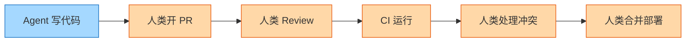
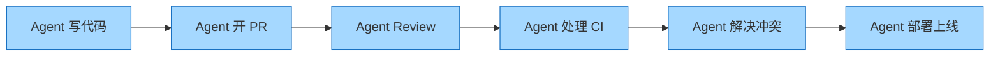

# Snap Specs、品味、Midjourney 硬件

## AR 眼镜战争 · 代理式编程基础设施 · AI 时代的 VC · 苹果路线图

TBPN · 2026-06-17

Eric Newcomer · Merrill Lutsky · Carter Reum · Swami Sivasubramanian · Thomas Suarez · Mark Gurman · Ryan Daniels · Isaiah Granet

---

# 为什么这期值得关注

<strong>AR 硬件决战</strong> 
Snap 砸 35 亿美元推出 $2,200 的 Specs，市场用脚投票——股价单日再跌 8.5%。同时独立开发者用不到八位数做出了对标产品。

<strong>代理式编程基础设施</strong> 
Cursor 收购 Graphite 后发布 Origin——为 Agent 时代从零设计的 Git。SpaceX 正式行使收购选择权。

<strong>AI 时代 VC 进化</strong> 
M13 十年前投 SpaceX $15B 估值，如今 150 倍回报。VC 的权力格局正在世代更替。

<strong>苹果 AI 路线图</strong> 
WWDC 2026：Siri 终于能用了。苹果自认落后 OpenAI 六个月，但预装 AI 的战略可能改写游戏规则。

<strong>品味能否被量化？</strong> 
Taste Labs 声称要"终结 AI 垃圾美学"，24 小时内百万浏览，引发硅谷关于品味的激烈论战。

<strong>语音 AI + 法律 AI</strong> 
Bland 融资 $50M，专攻"搞砸了会死人"的客服电话。Crosby 发布首个法律谈判 Agent 基准测试。

---

# Snap Specs：$2,200 的豪赌

### 📊 市场数据

92%

Snap 股价自峰值下跌

$35 亿+

Snap 在 AR 硬件上的累计投入

$2,195

Specs 零售价格

### 🎯 核心矛盾

<strong>如果是一家创业公司</strong>做出这些 Demo，以当前市场行情"轻松估值 10 亿美元以上"

<strong>但 Snap 是一家上市公司</strong>，股价从高点跌了 92%，每一分钱投入都被股东用放大镜审视

<strong>功能很酷，但谁需要？</strong> 测量家具尺寸、高尔夫测距、AR 白板协作——每个场景都"很酷但不常用"

作者概括：Specs 的困境是一个经典的"创新者困境"案例——估值逻辑不同，同样的产品在创业公司和上市公司手中会得到完全不同的评价。

---

# AR 眼镜的杀手应用之困

<strong>核心论点</strong>：新品类设备不需要一个"杀手应用"，它需要<strong>替代一个日常行为</strong>。

### 历史上成功的替代

| 设备 | 替代了什么 | 附加功能 |
|------|-----------|---------|
| iPhone | 功能手机 | iPod + 浏览器 |
| AirPods | 有线耳机 | Siri + 降噪 |
| Apple Watch | 手表 | 健康 + 通知 |

每次成功的核心是**先替代一个已经存在的行为**，然后在这个基础上叠加新能力。

### Specs 试图替代什么？

❌ <strong>替代手机？</strong> 功能不够、生态不足、太重

❌ <strong>替代眼镜？</strong> 太重、不舒服、不像普通眼镜

❌ <strong>替代测距仪？</strong> $150 vs $2,200，电池续航 3.5 小时 vs 6 小时

⚠️ <strong>没有明确的被替代品 = 没有购买理由</strong>

作者概括：Meta Ray-Ban 成功恰恰因为它先做好了一副好看的眼镜，AI 功能是附加品。Specs 的问题在于"功能先于形态"。

---

---
layout: two-cols
---

# 冷启动：AR 平台的鸡与蛋

## 开发者的理性冷漠

<strong>用户不够多 → 开发者不来</strong> 
<em>连 Apple Vision Pro 都没有吸引到足够开发者，尽管 vibe coding 让软件成本几乎为零。</em>

<strong>开发者不来 → 没有应用生态</strong> 
<em>开发者宁愿给 iOS App Store 做 App，因为那里有确定的用户和收入。</em>

<strong>没有生态 → 用户不买</strong> 
<em>没有足够的应用，$2,200 的眼镜只是一个昂贵的玩具。</em>

::right::

<Excalidraw
  drawFilePath="./co-design-stack.excalidraw"
  class="w-[440px]"
  :darkMode="false"
  :background="false"
/>

作者概括：AR/VR 设备面临一个比传统平台更难的冷启动问题——硬件成本太高导致早期用户基数太小，进而无法吸引开发者，形成恶性循环。

---

---
layout: two-cols
---

# Raven Prism：用小团队挑战巨头

## Thomas Suarez 的方法论

<strong>穿戴 12 年+</strong> —— Suarez 可能是世界上 AR 设备累计使用时间最长的人之一。所有设计决策来自第一手体验。

<strong>不到八位数预算</strong> —— 投资人告诉他"从设计到量产至少需要 $1 亿"，但他用不到 $10M 做到了。

<strong>美国本土制造</strong> —— 在旧金山实验室设计并组装，不依赖中国的 ODM 参考设计，实现快速迭代。

<strong>Linux 架构 + 眼动追踪</strong> —— 唯一在眼镜形态中做到眼动追踪的产品，内置两颗微型摄像头和独立协处理器保护隐私。

::right::

<Excalidraw
  drawFilePath="./character-space.excalidraw"
  class="w-[460px]"
  :darkMode="false"
  :background="false"
/>

---

# 微交互：AR 更务实的路径

Suarez 将 AR 使用场景分为三类，并认为行业应该<strong>先做出 AR 的 iPod，再谈 AR 的 iPhone</strong>。

### ✅ 第一层：微交互

5-10 秒进出

• 导航下一步方向 
• 通知预览 
• 切歌 
• 烹饪下一步步骤

今天就可以实现

### 🔶 第二层：参考信息

持续显示，解放双手

• AirPlay 手机屏幕 
• 固定上下文信息 
• 免提查阅资料 
• AI 辅助任务

基本可实现

### 🔮 第三层：空间体验

完整 AR/MR

• 共享虚拟白板 
• 3D 物体叠加 
• 沉浸式游戏 
• 测量与空间计算

需要更大 FOV 和更强算力

Suarez："我们想先做出 AR 的 iPod，再谈 AR 的 iPhone。"——逐层递进，而不是一步到位。

---

# Apple 的 AR/VR 路线图

<strong>Mark Gurman 透露的苹果 XR 时间表</strong>

2027 年底

带摄像头的 AirPods（项目 B798） 用于导航和环境感知

智能眼镜（无显示屏） 数据送云端 Siri AI 处理

2028-2029

全新 MR 头显 从零重新设计，非 Vision Pro 2

桌面机器人 "台灯" Apple Car 项目的遗产

更远的未来

真正的 AR 眼镜（带显示屏） 本年代末或更晚

Vision Pro 已"冻结" 不再有 Vision Pro 2 或 Vision Air

<strong>关键判断</strong>：Gurman 认为 Meta 的三层策略（普通眼镜 → HUD → 真 AR）中的"中间层 HUD"可能不会持久——"你要么想要双目沉浸式显示，要么就只要普通眼镜。"

---

---
layout: two-cols
---

# Cursor + SpaceX：年度最具想象力的收购

## 交易脉络

<strong>第一步</strong>：SpaceX 获得收购 Cursor 的<strong>选择权</strong>（option to acquire）

<strong>第二步</strong>：SpaceX <strong>行使选择权</strong>，交易进入反垄断审查阶段

<strong>现在</strong>：Cursor 举办首次大会 Compile，发布 Origin 等三项重大产品

<strong>Merrill Lutsky</strong>："我们设定了 7 月底的 Origin 等候名单目标，在产品发布后 <strong>24 小时内就达到了</strong>。"

::right::

<Excalidraw
  drawFilePath="./three-pillars.excalidraw"
  class="w-[430px]"
  :darkMode="false"
  :background="false"
/>

---

# Origin：为 Agent 时代重建 Git 基础设施

<strong>核心洞察</strong>：软件开发工具链的每一环——Git、CI、代码审查——都是为"人类编写每一行代码"的世界设计的。当 Agent 产生的代码量呈指数级增长时，这些基础设施正在"崩塌"。

### 旧 Git 的问题

❌ <strong>吞吐量瓶颈</strong>：团队从每小时几十次 push 变成<strong>数千次</strong>

❌ <strong>Agent 上下文丢失</strong>：一开 PR，Agent 就"消失"了——无法处理 review、CI 失败、合并冲突

❌ <strong>无 Agent 追踪</strong>：看不到 Agent 的推理过程、引用了什么、做了什么决策

### Origin 的设计哲学

✅ <strong>从零设计的高吞吐</strong>：内部测试达 80 clone + 22 push/秒，零宕机

✅ <strong>Agent 原生架构</strong>：存储 Agent 追踪、操作历史、推理过程

✅ <strong>全自动 PR</strong>：Agent 可以自己处理 review、CI 失败、合并冲突——"从代码生成到上线无需人类干预"

---

# 代码量的指数级爆炸

<strong>问题</strong>：Agent 产生的代码量正在指数级增长，但部署流程仍然是线性的人类节奏。代码生成快了 10 倍 → 技术债务积累也快了 10 倍。

10x-20x

AWS 前沿团队的生产力提升

月均 Token 花费仅 $2,000-3,000

数千次/时

Agent 时代的团队 push 频率

旧基础设施只能处理"几十到几百次"

22 push/秒

Origin 的内部压力测试结果

80 clone + 22 push/秒，零宕机

<strong>Swami Sivasubramanian（AWS）的洞察</strong>："大家都只关注写代码的 Agent，但代码写完之后呢？部署到真实世界是更大的挑战。代码量 10 倍增长，部署速度还是 1 倍——一切都会变成技术债务。<strong>你需要让代码生成、部署、安全测试全都 Agent 化。</strong>"

---

# 全自动驾驶的 PR：从代码到上线

## 当前工作流

🔵 = Agent 执行 &nbsp; 🟠 = 人类瓶颈

## Origin 的目标状态

全链路 Agent 化，人类只在关键决策点介入

<strong>Lutsky</strong>："我们希望达到这样一个愿景：PR 可以<strong>全自动驾驶</strong>，从创建到部署上线，在很多情况下<strong>无需人类干预</strong>。"

---

# M13：为创始人设计的 VC

<strong>Carter Reum 的 VC 哲学</strong>：M13 的名字取自夜空中最亮的星团——"比组成它的所有恒星加起来还亮"。核心命题：连接节点，创造超额价值。

### 🏗️ 投资型团队

12 人负责资金部署 寻找 TAM 和优秀创始人

17 家独角兽的种子/A 轮投资人

### 🚀 推进型团队

前运营商不做投资 而是"在投资组合上运营"

前 DigitalOcean 高管从零到 $190 亿 IPO

### 🎯 核心纪律

每张支票的基础情况 必须能<strong>返还基金的一半</strong>

$4 亿早期基金，需要 3-5 个 $30-50 亿公司

<strong>"每个人都说风投有风险"</strong>——但殖民火星的风险和让人们用 App 打车的风险不在同一个量级。VC 的工作不是回避风险，而是判断<strong>风险是否值得回报</strong>。

---

# SpaceX：从 $15B 到 150 倍回报

### 一笔改变游戏规则的投资

<strong>入场点</strong>：M13 第一支基金，以 <strong>$150 亿估值</strong>投资 SpaceX

<strong>等待时间</strong>：<strong>10 年</strong>才回收资本

<strong>回报倍数</strong>：<strong>150 倍</strong>

### 为什么这次 IPO 与众不同

<strong>散户渗透率极高</strong>：SpaceX 的股票大量通过 SPV 卖给个人——"每个在乡村俱乐部、Burning Man 和 YPO 的人都有份"

<strong>财富效应史无前例</strong>：有人赚了 300 万，有人赚了 1 亿，有人赚了 10 亿——"这是一场财富海啸"

<strong>对风投生态的影响</strong>：大量资金回流系统，LP 们看到"这些东西需要很长时间，但回报是真实的"

---

---
layout: two-cols
---

# VC 的权力游戏：两种游戏，两种规则

<strong>核心问题</strong>：今天的 VC 行业，到底谁才是真正的"一线基金"？创始人最想跟谁合作？

### 游戏一：光环与信用

衡量"创始人想不想跟你合作"

• 10 张 Term Sheet → 创始人选谁？ 
• Sequoia 的"正面捅刀"反而成了品牌护城河 
• Thrive、Greenoaks 等新一代 GP 正在崛起 
• "创始人想要的是基金的<strong>创始人</strong>，不是继承人"

### 游戏二：现金回报

衡量"你到底退了多少钱"

• Cursor：<$1B → $60B，三年经典 VC 
• SpaceX：$15B → 150x 
• 投入 $100 亿到 $500B Lab，翻倍 = $100 亿利润 
• "VC 是一门生意，目标是产出现金"

::right::

<Excalidraw
  drawFilePath="./vc-games.excalidraw"
  class="w-[430px]"
  :darkMode="false"
  :background="false"
/>

---

# 风投格局的代际更替

### Old Guard 的挑战

<strong>Arthur Rock</strong>：投过 Apple、Intel 的传奇，2009 年因与 Bernie Madoff 牵连陨落——一代神话的终结值得深思

<strong>Benchmark 重建中</strong>：Travis 和 Emile 在重塑品牌，但 EIR 那句"我们不会背后捅刀，我们会当面捅"发生的时候他们还在上大学

<strong>Sequoia 的"非创始人友好"</strong>反而成了差异化——有创始人说："我需要他们逼我更努力，如果我不够好就炒掉我"

### New Guard 的优势

<strong>创始人办 VC</strong>：M13 的理念——"按创始人的方式构建 VC"，全员运营背景，只有一个前 VC 出身的人

<strong>操作型 VC</strong>：不只是在董事会上给建议，而是直接提供数据、人才、增长运营——"在 A 轮阶段填补创始团队的缺口"

<strong>年轻血液</strong>：Reum："你需要最优秀的 22 岁斯坦福退学生来发现下一个独角兽——GP 不可能在晚餐时遇到他"

---

# WWDC 2026：Siri 终于能用了

<strong>Mark Gurman 的现场评测</strong>：新 Siri 的"个人上下文"功能是两年前就应该交付的东西——苹果当时花 180 分钟介绍 AI，其中只有 5 分钟的内容延迟了，但<strong>延迟的恰恰是唯一重要的那 5 分钟</strong>。

### 新 Siri 能做什么

✅ "把我 XYZ 的笔记发给那个人"

✅ "发送我未来两个月的日历可用性"

✅ 跨应用工作流自动化

### 苹果自认的差距

<strong>落后 OpenAI 约 6 个月</strong>——在 Siri 的核心用例（搜索、问答、编辑）上

<strong>基础模型质量大幅提升</strong>：两年前的底层模型"根本不行"，现在的模型让一切"终于能用了"

<strong>Gurman 的关键判断</strong>："95% 的人不需要在 iPhone 上装 ChatGPT——因为 Siri AI 预装了。就像你可以从 App Store 下载更好的浏览器，但自带的 Safari 对大多数人够用了。"

---

---
layout: two-cols
---

# 苹果 AI 策略：预装 vs App Store

### 预装 AI（Siri AI）

够用、免费、系统级集成

📱 搜索、问答——"新时代的 Google"

✏️ 文字编辑、日历、邮件自动化

🎨 Image Playground / Genmoji

对 95% 的用户"已经足够"

### 专业级 AI（ChatGPT / Claude）

需要付费订阅，深度能力

🔬 深度研究、大文档分析

📊 税务准备、多文件对比

💻 专业编程、健康咨询

类比：iMovie vs Final Cut Pro

<strong>战略意义</strong>：苹果两年前的基础模型"根本不能打"。现在 Siri AI 的底层模型"好太多了"——图像生成接近 ChatGPT/Gemini 水平，Siri 的实际体验已超越 ChatGPT 的基础用例。

::right::

<Excalidraw
  drawFilePath="./ai-strategy.excalidraw"
  class="w-[430px]"
  :darkMode="false"
  :background="false"
/>

---

# iPhone 路线图：苹果史上最密集的产品周期

<strong>Gurman</strong>："2027 年将是苹果历史上最大的产品年。"

### 2026 秋

iPhone 18 Pro / Pro Max

• 首款<strong>折叠屏 iPhone</strong>（"iPhone Ultra"） 
• 预计 $2,000+ 
• 2nm A20 Pro 芯片

### 2027 春

iPhone 18 + iPhone Air 2

• 更好电池续航 
• 双摄像头（超广角） 
• $999 价位 
• 更高效 2nm 芯片

### 2027 秋

iPhone 20 周年纪念版

• 完全重新设计 
• 曲面玻璃 
• 更窄边框 
• 更小灵动岛 
• 第二款折叠屏

<strong>有趣细节</strong>：iOS 27 将支持<strong>多设备单号同步</strong>——一个电话号码和运营商账户可以在两台 iPhone 之间同步。Gurman 开玩笑说："我不知道该买哪台——折叠屏、Air 还是 20 周年纪念版？我三台都想要。"

---

# Vision Pro 冻结，智能家居接手

### Vision Pro：被冻结的旗舰

❌ Vision Pro 2 已取消

❌ Vision Air（更便宜版）已砍掉

🔄 全新 MR 头显从零重做，预计 2028-2029

💡 曾考虑做 $5,000 "医疗/企业版"

### 智能家居：新支柱

✅ <strong>智能家居显示屏</strong>：最早 2026 年底发布，面部识别、个性化 Siri、FaceTime、智能家居控制

✅ <strong>"台灯"桌面机器人</strong>：2028 年，带机械臂可移动——<strong>Apple Car 项目的遗产</strong>

✅ <strong>家居安全产品</strong>：苹果智能家居的第三支柱

<strong>Gurman</strong>："苹果现在的两大支柱是 AI 可穿戴设备和 AI 智能家居。'台灯'项目由 Kevin Lynch 领导——这个人之前负责 Apple Watch 软件，然后接管了整个 Apple Car 项目，现在在做台灯。"

---

# AWS Agentic AI：打破"围墙花园"

<strong>Swami Sivasubramanian</strong>：AWS VP of Agentic AI，在 AWS 工作了 20 年。实习项目是构建 Amazon DynamoDB。现在负责推动企业从"AI 原型"走向"AI 生产"。

### 企业的 Agent 瓶颈

🔒 <strong>围墙花园</strong>：Outlook → Slack → 各种工具——每个工具都有 AI 助手，但它们<strong>互不相通</strong>

⏰ <strong>上下文损失</strong>：每天花 1 小时以上"同步"——跟进邮件、Slack、通知

### AWS 的解法

🤖 <strong>Quick Autonomous Agent</strong>：跨工具收集上下文，"为你工作，你不在的时候也在工作"

🛡️ <strong>Continuum</strong>：安全 Agent，"像抗体对抗病毒一样持续运行"——不是一次性检查，而是永不停止

15,000

GoDaddy 用 Quick Agent 节省的人工小时数

Q1 单季

Bedrock 请求量超过了 之前所有年份的总和

$2K-3K/月

前沿团队 Token 月花费 换来 10x-20x 生产力提升

---

# 企业 AI：从概念验证到生产环境

<strong>关键时刻</strong>：AWS 的 Bedrock 平台在 2026 Q1 的请求量超过了之前所有年份的总和。企业正在从"做一个酷炫 Demo 给高管看"转向"把它部署到生产环境创造真实价值"。

### Amazon 内部的 AI 使用

<strong>第一阶段</strong>：让每个人都熟悉工具——大规模试用

<strong>第二阶段</strong>：每个 VP 的团队跟踪用量和成本——"你花了多少 Token？产出了什么？"

<strong>Bedrock + Cost Explorer</strong>：按用户、按模型、按组织维度监控支出和 ROI

### 企业的真实案例

✈️ <strong>Southwest Airlines</strong>：在 Agent Core 上构建机组排班 Agent

🏢 <strong>3M</strong>：用 Agent 优化销售拜访规划

📊 <strong>NBA、GoDaddy</strong>：Quick Agent 自动化数据分析和报告生成

---

# Agent 不止于写代码

<strong>Swami 的核心观点</strong>：每个人都在谈 Coding Agent，但真正的 Agent 革命发生在人们<strong>看不到的地方</strong>——那些在假期里仍然在运行的自动化工作流。

### 💻 代码生成

最广为人知的 Agent 用例

• Claude Code / Cursor 
• Amazon Q Developer 
• "10-20x 生产力提升"

已经成熟

### 🚀 持续部署 & 安全

代码之后的关键瓶颈

• 自动部署 Agent 
• 渗透测试 Agent 
• "写了就要能发布，发布了就要能保持"

正在发展

### 🏢 业务流程自动化

最被低估的领域

• 机组排班（Southwest） 
• 客服自动化（Bland） 
• 销售规划（3M） 
• 法律谈判（Crosby）

快速崛起

---

---
layout: two-cols
---

# 新闻业的 AI 防线

### Eric Newcomer 的"逆向乐观主义"

📰 <strong>从地方报纸到 Bloomberg 六年</strong>——经历过"科技博主"的过度乐观，也经历过政治记者"盯死 Facebook"的过度负面

🔄 <strong>"逆向乐观主义"</strong>——为硅谷圈内人写作，不需要解释 Andreessen 和 Gurley 是谁

### AI 对新闻业的威胁与防线

🤖 已有人的 Substack 排名被 AI 内容超越——"一个明显在用 AI 写稿的人排名比我高"

🛡️ <strong>独家新闻是最强护城河</strong>——"群聊、DMs 里流动的信息，AI 进不去"

📝 AI 做 copy editor 很好——"过一遍 Claude，它能抓 million/billion 这种低级错误"

<strong>收入模型</strong>：活动赞助（第一）+ 订阅（第二）+ 广告。三重收入流——新媒体领域反直觉的多元化。

::right::

<Excalidraw
  drawFilePath="./journalism-moat.excalidraw"
  class="w-[430px]"
  :darkMode="false"
  :background="false"
/>

---

---
layout: two-cols
---

# Taste Labs：品味可以被编码吗？

### 争议的引爆点

💥 <strong>24 小时内百万浏览</strong>：前 Exa AI Labs 团队成员推出 Taste Labs，"使命是终结 AI 垃圾美学"

🗣️ <strong>"品味疲劳"</strong>——人们厌倦了"品味"这个词。过去一年它成了硅谷的口头禅——"当 AI 能做所有技术活，剩下的就是品味"

🎯 <strong>核心批评</strong>：给 AI Lab 做数据标注——告诉模型什么"好看"什么"不好看"——但这恰恰是把"品味"变成了可复制的模板

### 品味悖论

💡 <strong>SquareSpace 效应</strong>：高端设计"货币化"之后，所有人都有漂亮网站——但也失去个性。"这是 SquareSpace 网站还是自己做的？"

💡 <strong>Linear 效应</strong>：高品味产品 → 被整个行业模仿 → "品味是原创性，一旦被复制就不再是品味"

⚡ <strong>短期内能赚钱</strong>——但五年后呢？"像这个赛道很多公司一样，非常不确定"

::right::

<Excalidraw
  drawFilePath="./taste-cycle.excalidraw"
  class="w-[430px]"
  :darkMode="false"
  :background="false"
/>

---

# 硅谷的"品味"论战

<strong>论战的核心</strong>：硅谷——一个以 T 恤和运动休闲装闻名的社区——是否有资格谈论"品味"？

### 批评者的视角

"圈外人"的质疑

👔 旧金山的"时尚"是连帽衫和 Allbirds

🎨 科技圈对艺术的认知浅薄

📐 硅谷美学 = "效率优先，品味靠边"

### 辩护者的视角

为什么要做这件事

🔧 AI 生成的设计确实有明显的"AI 感"——vibe code 的项目一眼就能认出来

📊 数据标注已经有先例——"图片有几根手指"是两年前的有用标注，现在"什么看起来好"是下一个

💼 超大规模云厂商和 AI Lab 都在花钱解决这个问题——市场需求真实存在

<strong>TBPN 主持人的判断</strong>："Taste Labs 过去 24 小时挨了很多骂，但他们的 pipeline 可能爆炸了。短期内他们肯定能赚钱。但名字确实起得好——<strong>我们在实验室里制造品味。</strong>"

---

# Bland：搞砸了会死人的 AI 电话

<strong>Isaiah Granet, Bland CEO</strong>：融资 $50M（Dell + HubSpot 参投）。专注"最复杂的、搞砸了会有人起诉或死人"的客服电话。自训模型，不使用 OpenAI。

### 为什么语音 AI 比想象中更难

🏦 <strong>银行合规</strong>：必须朗读 1.5 分钟的合规声明——"在 AI 跟用户说话之前，用户必须听完 1.5 分钟的声明朗读"

🏥 <strong>90 岁患者的远程监控</strong>：45 分钟的电话中，你必须先听完孙辈的故事——"这是绕不过去的人性需求"

📞 <strong>350,000 自助用户</strong>——但大部分是企业级 inbound leads

### 语音 AI 市场的独特之处

🔒 <strong>竞争比 Coding Agent 少得多</strong>——尽管前沿 Lab 也在做

💡 <strong>市场规模巨大</strong>：美国每年 $2,500 亿的呼叫中心支出

🎤 <strong>买下 Soulja Boy 的声音版权</strong>做病毒营销——CIO 们在高中时正是 Soulja Boy 的粉丝

---

---
layout: two-cols
---

# Crosby：AI 律师谈判基准测试

### 测试设置

首个模拟完整律师谈判过程的基准测试

⚖️ <strong>双方律师多轮谈判</strong>——从首次 Redline 到最终协议

👥 <strong>真实律师作为对照组</strong>——用同一立场进行谈判，观察律师之间的分歧程度

📏 <strong>基于律师行为构建评分标准</strong>——没有"标准答案"

::right::

<Excalidraw
  drawFilePath="./scaling-curve.excalidraw"
  class="w-[430px]"
  :darkMode="false"
  :background="false"
/>

<strong>关键发现</strong>：所有模型在首次 Redline 时表现都很差（无法发现初始问题），但在后续回合中改善明显。最大的问题是：<strong>模型太倾向于说"Yes"</strong>——"为了推进交易而接受条款，这不是好律师。好律师知道怎么让对方觉得自己赢了，同时保护客户利益。"

---

# AI 法律谈判：模型对比与深层洞察

GPT 5.5

50.5

最高分

Fable 5

47.3

仅一次测试* 访问已中断

Opus 4.8

44.4

第四名

Gemini 3.5 Flash

45.1

第三名

### 律师 vs Agent 的差异

📊 <strong>越到谈判后期，人类律师的内部一致性越低</strong>——"他们都是资深律师，但谈判越深入，处理方式差异越大"

🎯 <strong>谈判没有"正确"答案</strong>——"也许用全大写字母吼对方，对方就直接接受了"

### 未来的方向

🛠️ <strong>定制化的 Harness</strong>可以大幅提升分数——"专门针对 Word 文档编辑做了很多优化"

🧠 <strong>后训练模型</strong>在"判断力"和"陈述推理过程"上可能有突破

💰 <strong>Token 成本根本不是问题</strong>——"只要支出低于 $1,000/小时（律师费率），都是好生意"

---

# Midjourney 硬件：AI 图像巨头的野心

<strong>今晚 6PM</strong>——David Holz（Midjourney 创始人，前 Magic Leap 联合创始人）将发布 Midjourney 的首款硬件产品。<strong>至今没有任何泄露</strong>——这在硬件行业极为罕见。

### 已知信息

🛠️ 硬件工程负责人来自<strong>Apple Vision Pro 团队</strong>——Vision Pro 硬件团队的前经理

⏱️ 团队已研发<strong>数年</strong>

📦 Gurman 得到消息：产品<strong>"体积较大"</strong>——可能排除头戴设备

### David Holz 的背景

🔮 创办 <strong>Magic Leap</strong>——手部追踪设备公司（关于一个小型手部追踪装置），差点卖给 Apple，后来卖给另一家公司

🎨 重新出发创建 <strong>Midjourney</strong>——"极有才华的团队、极好的商业、极好的创始人"

📈 与 Meta 有许可协议，资金充裕——"没有成千上万亏钱的股东，纯粹的上行空间"

<strong>TBPN 的判断</strong>："硬件很难，但越多尝试越好。Midjourney 作为私有公司的优势在于——大家对 Snap 的负面反应很大程度上是因为股东亏了钱。<strong>你没有股东包袱，就全是上行空间。</strong>"

---

---
layout: two-cols
---

# 一条主线：AI 正在吞噬一切

## 🔗 连接所有对话的主题

<strong>硬件与 AI 的融合</strong> 
AR 眼镜、智能家居、Midjourney 硬件——每一块屏幕都在变成 AI 的前端

<strong>基础设施的 Agent 化</strong> 
Git、部署、安全测试——整个软件开发工具链正在从"为人设计"转向"为 Agent 设计"

<strong>专业判断的 AI 化</strong> 
法律谈判、医疗电话、新闻采编——AI 正在进入"搞砸了会有人起诉"的领域

<strong>品味与原创性的张力</strong> 
AI 让设计民主化，但也让一切看起来一样——"企业新孟菲斯"的幽灵

::right::

<Excalidraw
  drawFilePath="./latent-demand.excalidraw"
  class="w-[440px]"
  :darkMode="false"
  :background="false"
/>

---

# AI 时代的投资与基础设施正反馈循环

<strong>本期揭示的核心循环</strong>：AI 能力提升 → Agent 产生更多代码 → 需要新的基础设施 → 基础设施又让 Agent 更强 → 吸引更多投资 → 进一步加速研发

💰 资本层

SpaceX IPO 回流千亿 M13 种子策略 150x Frontier Lab 军备竞赛

🔧 基础设施层

Origin / Agent 原生 Git AWS Agent Core Continuum 安全 Agent

📱 应用层

Bland 语音 AI Crosby 法律 Agent Raven AR 眼镜 Apple Siri AI

<strong>关键观察</strong>：这三层正在形成前所未有的正反馈循环。Carter Reum："当你想到 OpenAI 和 Anthropic IPO 时，VC 会赚很多钱——但那些 LP 是大学捐赠基金和养老基金。<strong>SpaceX 不一样——它的股东是每一个在乡村俱乐部的人。</strong>"这种财富效应的广度是史无前例的。

---

# 核心金句（一）

这期对谈里最值得记住的几句：

"我写下了'逆向乐观主义'——在我开始做科技记者时，我比大多数人都更负面。到了离开 Bloomberg 时，政治记者们又在死盯 Facebook。我只想为真正理解硅谷的人写作。"

— Eric Newcomer，谈自己的新闻理念

"软件开发工具链的每一环都是为了'人类写每一行代码'的世界设计的。当 Agent 产生的代码量指数级增长时，这些基础设施正在崩塌。"

— Merrill Lutsky，谈 Origin 的设计动机

"我们一直相信没有单一模型能统治世界。这在当时不是主流观点，但现在看来太明显了。"

— Swami Sivasubramanian，谈 AWS Bedrock 的多模型策略

---

# 核心金句（二）

更多值得铭记的判断：

"95% 的人不需要在 iPhone 上装 ChatGPT——Siri AI 预装后就够用了。就像你可以下载更好的浏览器，但 Safari 对大多数人来说已经足够。"

— Mark Gurman，谈苹果的 AI 策略

"我们想做的是先做出 AR 的 iPod，再谈 AR 的 iPhone。你需要一个轻量、好看的形态，人们才愿意每天都戴着它。"

— Thomas Suarez，谈 Raven Prism 的产品哲学

"品味一旦被复制就不再是品味。SquareSpace 让每个人都能有漂亮的网站，但也让这些网站看起来都一样了。"

— TBPN 主持人，论品味悖论

"每张支票的基础情况必须能返还基金的一半。你需要 3-5 个 $30-50 亿的公司，然后祈祷其中有一个是下一个 SpaceX。"

— Carter Reum，谈 VC 的数学

---

---
layout: end
---

# 谢谢观看

TBPN · 2026 年 6 月 17 日

AR 眼镜战争 · 代理式编程基础设施 · VC 的权力更替 · 苹果 AI 路线图

← PodDeck

